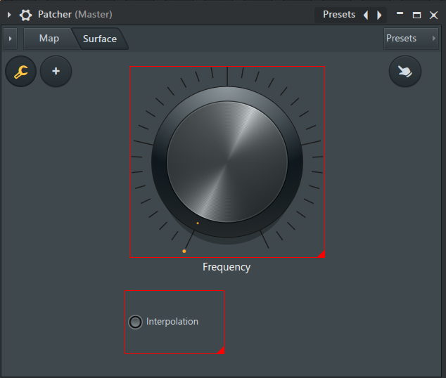
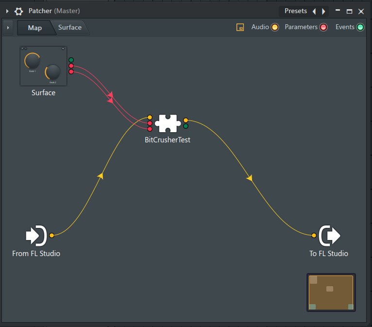
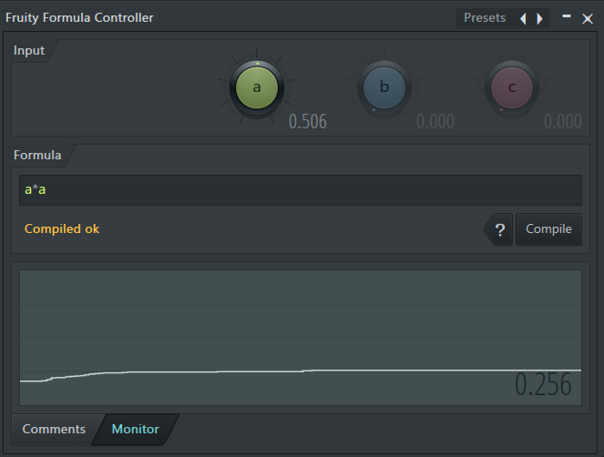

## はじめに

普段もFLStudioを使っているのですが、プラグイン制作においてもFLStudioは最適なDAWであると感じています。

## プラグイン開発でFL Studioを使うメリット
その理由をいくつか紹介します。

### 1. 起動の速さ

FLStudioは他のDAWに比べて起動が早いです。  
開発中に何度もDAWを再起動してテストすることが多いので、これは非常に助かります。

理由として、

- プラグインを起動時にロードしない：使うまでDLLを読み込まない遅延ロード設計
- スキャンの分離：プラグインスキャンは起動とは切り離されており、初回以降はキャッシュ参照のみ
- 軽量なコアエンジン：DAW本体の初期化処理が他のDAWより少ない

そのため、手軽にプラグインを読み込んでテストすることができます。
小さな変更を試すために、DAWの起動時間で待機させられることが少ないです。

### 2. Patcherの存在

これが一番大きな理由です。
#### そもそもPatcherとは何なのか

一言で言うと： プラグインやエフェクトをグラフィカルに配線できるモジュラー式ラッパーです。

| 他のDAW的な概念 | Patcherでの位置づけ |
|------|------|
| インサートエフェクトチェーン | Patcher内で自由な順序・並列配線が可能 |
| Rack / Instrument Chain | 複数音源をまとめて1つのプラグインとして扱える |
| Max for Live (Ableton) | 近いが、コーディングが必要ない |  

#### できること

- VSTやFL純正プラグインをノードとして配置し、信号の流れを視覚的につなぐ
- 直列・並列・フィードバックなど自由なルーティング
- Patcher内部のノブ・スイッチ類をカスタムUIパネルとしてまとめて表示できる
- ノブ・スイッチ類はエフェクトのパラメーターに接続して、まとめて操作できる
- 複数の音源やエフェクトをまとめて1つのプリセットとして保存・呼び出し
- Patcher自体をPatcherの中に入れてネストできる

開発であれば、3,4番が特に強力な機能となります。

#### カスタムUIパネル

ユーザーがUIのパネルを配置する機能です。
C++コードで一からUIを構築すると圧倒的に時間がかかると思います。おおよその構成を作れるのは非常に強いです。
デザイン系ソフトでUIを構築する場合、ディティールの調整に時間がかかってしまうので、ある程度見た目が固定されているもののほうがやりやすいと思います。

#### ノブ類のパラメーター接続

ユーザーが配置したUIコンポーネントと、プラグインの内部パラメーターを接続する機能です。
JUCEフレームワークを使っている場合、`GenericAudioProcessorEditor`でパラメーターを画面に表示させることができますが、Patcherを使うとカスタムUIパネルで作った配布品により近い簡易UIで、おおよその使い心地をてすとできます。スライダーからノブに変えた際、内部パラメーターの変化カーブの体感のレスポンスが変わることがあるので、それをコードを書く前に把握しておくことができます。

Fruity Formula Controllerを使えば、ノブやスライダーのカーブを変化させることができます。

### 3. 可変バッファ

FLStudioは動的にバッファサイズが変化するDAWです。FLStudioで使用することで、事前にバッファサイズの変化に耐えられるのかテストできます。

## より確実なテストのために
FLStudioはUI構成案のテストや、実戦状況を考えてのデバッグには向いていますが、FLStudioだけで済ませるのは良いとは言えません。

### Plugin Doctorによる厳密なDSP検証

絶対にやるべきだと思っています。
JUCEの場合のみかも知れませんが、Lしか処理しないDSPクラスをLRどちらも処理してくれるものだと勘違いをして、結果Rだけ音量が微妙に変わってしまったりすることがありました。
LとRで音量が違うという事実があっても、どちらが正しいかは目に見える視覚化をするべきだと思います。
バッファのオフセット計算などで絶妙に位相がズレてしまったりなど、耳ではあまり感知できないものも視覚化して見ることができるので、DSPアルゴリズムのテストで使用することをおすすめします。

### 他DAWでのクロスホストチェック

FLStudioが可変バッファを採用するなど、他社のDAWでも仕様が違う場合がほとんどなので、他社のDAWで読み込んで正常に動作するかをテストしておくと安心です。

## まとめ

FLStudioは起動の速さ、Patcherの柔軟さ、可変バッファの3点で、プラグイン開発の試行錯誤を大きく加速してくれます。
ただし、FLStudioだけで完結させるのは危険なので、Plugin DoctorでDSPを可視化し、他DAWでのクロスホストも行いましょう。
手早い仮組みと厳密な検証を両立できれば、開発の質とスピードは一段上がります。
